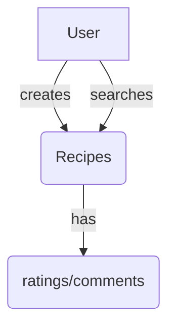
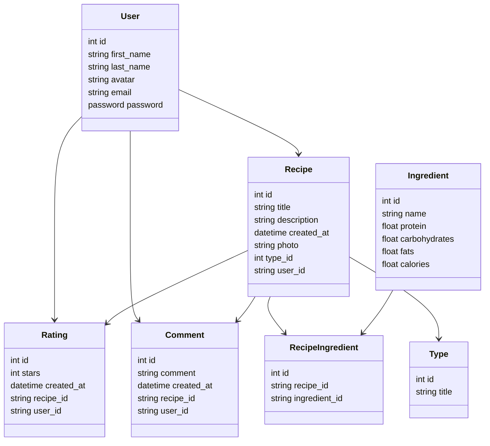

# Overview

### Problem Definition

Many individuals struggle to find recipes that align with their specific dietary needs and nutritional requirements.

### Solution

The proposed solution is to develop an application that allows users to easily find and create recipes with detailed nutrient information.

### Priorities

#### Must have

- Users must be able to create recipes that includes detailed nutrient information, including protein, carbohydrates, fats and calories.
- Users must be able to filter recipes based on their preferences and easily find suitable options.
- Users must be able to view the nutritional breakdown of the entire recipe and individual ingredients.

#### Should have

- Users should have the ability to rate and leave comments on recipes they have tried.

#### Could have

- The application could allow users to create collections of their favorite recipes and save them for future reference.
- The application could allow users to share recipes to other users.

#### Will not have

- Users will be able to set dieting goals.
- The application will give recomendations.

#### Domain Model Diagram



#### Entity Relationship Diagram



### API Specification

### Users

GET _/users_

> response: 200 OK

```json
[
  {
    "id": 1,
    "first_name": "Jhon",
    "last_name": "Test",
    "avatar": "https://dieting.com/storage/4353466.png"
    "created_at": "2023-26-05 10:27:21.532056",
    "email": "jhon.test@unosquare.com"
  },
  {
    "id": 2,
    "first_name": "Julia",
    "last_name": "Test",
    "avatar": "https://dieting.com/storage/4353466.png"
    "created_at": "2023-26-05 10:27:21.532056",
    "email": "julia.test@unosquare.com"
  }
]
```

GET _/users/1_

> response: 200 OK

```json
{
  "id": 1,
  "first_name": "Jhon",
  "last_name": "Test",
  "created_at": "2023-26-05 10:27:21.532056",
  "email": "jhon.test@unosquare.com"
}
```

POST _/users_

> response: 201 OK

```json
{
  "id": 1,
  "first_name": "Jhon",
  "last_name": "New",
  "created_at": "2023-26-05 10:27:21.532056",
  "email": "jhon.new@unosquare.com"
}
```

PUT _/users/1_

> response: 201 OK

```json
{
  "id": 1,
  "first_name": "Jhon",
  "last_name": "Test updated",
  "created_at": "2023-26-05 10:27:21.532056",
  "email": "jhon.test@unosquare.com"
}
```

DELETE _/users/1_

> response: 204 No content

### Recipes

GET _/recipes_

> response: 200 OK

```json
[
  {
    "id": 1,
    "title": "Honey garlic chicken",
    "created_at": "2023-26-05 10:27:21.532056",
    "photo": "https://dieting.com/storage/35435634.png",
    "rating_avg": 4.5,
    "comments": 5,
    "type": "Low-fat diet",
    "nutriends": {
      "protein": 25,
      "carbohydrates": 40,
      "fats": 15,
      "calories": 200
    }
  },
  {
    "id": 2,
    "title": "Crispy BBQ tofu sandwich",
    "created_at": "2023-26-05 10:27:21.532056",
    "photo": "https://dieting.com/storage/35435634.png",
    "rating_avg": 4,
    "comments": 10,
    "type": "Vegan",
    "nutriends": {
      "protein": 20,
      "carbohydrates": 40,
      "fats": 15,
      "calories": 200
    }
  }
]
```

GET _/recipes/1_

> response: 200 OK

```json
{
  "id": 1,
  "title": "Honey garlic chicken",
  "created_at": "2023-26-05 10:27:21.532056",
  "photo": "https://dieting.com/storage/35435634.png",
  "rating_avg": 4.5,
  "type": "Low-fat diet",
  "nutriends": {
    "protein": 25,
    "carbohydrates": 40,
    "fats": 15,
    "calories": 200
  },
  "comments": [
    {
      "id": 1,
      "comment": "Delicious, hightly recommended",
      "created_at": "2 hours ago",
      "user": {
        "name": "Jhon",
        "avatar": "https://dieting.com/storage/35435634.png"
      }
    },
    {
      "id": 2,
      "comment": "I really loved it",
      "created_at": "6 hours ago",
      "user": {
        "name": "Julia",
        "avatar": "https://dieting.com/storage/35435634.png"
      }
    }
  ]
}
```
