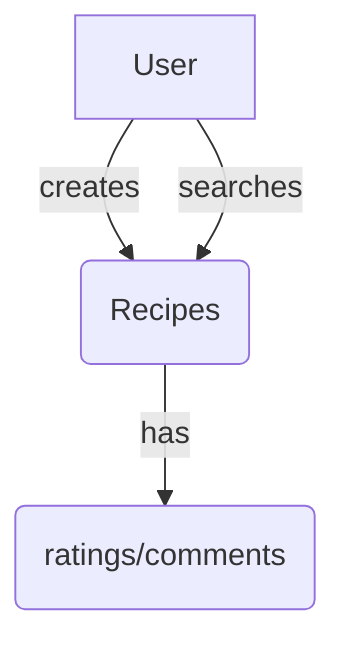
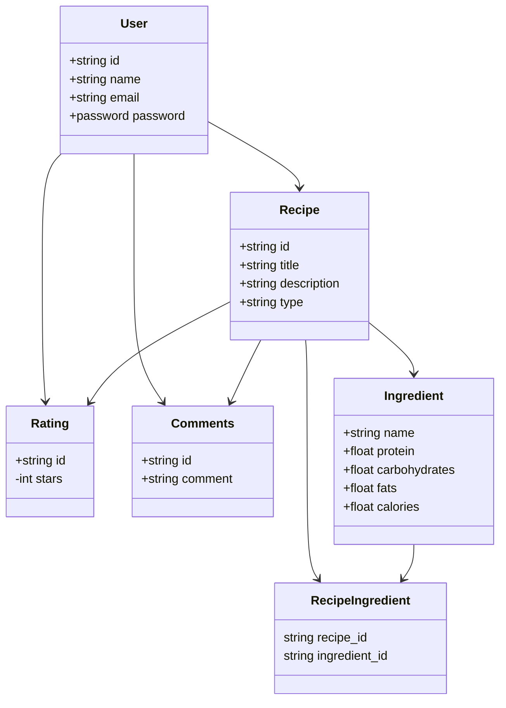

# Overview

### Problem Definition

Many individuals struggle to find recipes that align with their specific dietary needs and nutritional requirements.

### Solution

The proposed solution is to develop an application that allows users to easily find and create recipes with detailed nutrient information.

### Priorties

#### Must have

- Users must be able to create recipes that includes detailed nutrient information, including protein, carbohydrates, fats, calories, vitamins, and minerals.
- Users must be able to filter recipes based on their preferences and easily find suitable options.
- Users must be able to view the nutritional breakdown of the entire recipe and individual ingredients, enabling them to make informed choices based on their dietary goals.

#### Should have

- Users should have the ability to rate and leave comments on recipes they have tried.

#### Could have

- The application could allow users to customize their dietary preferences and set specific nutritional goals.
- The application could allow users to create collections of their favorite recipes and save them for future reference.

#### Domain Model Diagram

#### Entity Relationship Diagram

