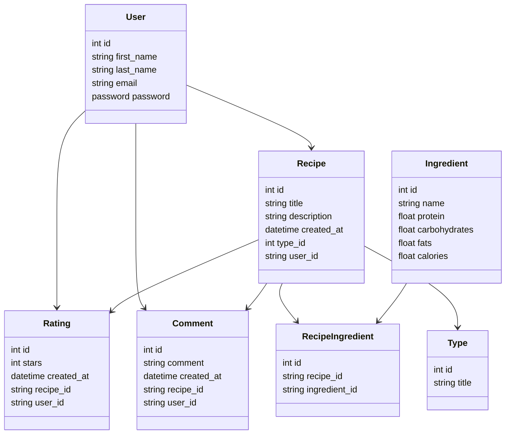

# Overview

### Problem Definition

Many individuals struggle to find recipes that align with their specific dietary needs and nutritional requirements.

### Solution

The proposed solution is to develop an application that allows users to easily find and create recipes with detailed nutrient information.

### Priorities

#### Must have

- Users must be able to create recipes that includes detailed nutrient information, including protein, carbohydrates, fats and calories.
- Users must be able to filter recipes based on their preferences and easily find suitable options.
- Users must be able to view the nutritional breakdown of the entire recipe and individual ingredients.

#### Should have

- Users should have the ability to rate and leave comments on recipes they have tried.

#### Could have

- The application could allow users to create collections of their favorite recipes and save them for future reference.
- The application could allow users to share recipes to other users.

#### Will not have

- Users will be able to set dieting goals.
- The application will give recomendations.

#### Domain Model Diagram


#### Entity Relationship Diagram



### API Specification

#### Users

GET /users
response: 200 OK

```json
[
  {
    "id": 1,
    "first_name": "Jhon",
    "last_name": "Test",
    "created_at": "2023-26-05 10:27:21.532056",
    "email": "jhon.test@unosquare.com"
  },
  {
    "id": 2,
    "first_name": "Julia",
    "last_name": "Test",
    "created_at": "2023-26-05 10:27:21.532056",
    "email": "julia.test@unosquare.com"
  }
]
```

GET /users/1
response: 200 OK

```json
{
  "id": 1,
  "first_name": "Jhon",
  "last_name": "Test",
  "created_at": "2023-26-05 10:27:21.532056",
  "email": "jhon.test@unosquare.com"
}
```

POST /users
response: 201 OK

```json
{
  "id": 1,
  "first_name": "Jhon",
  "last_name": "New",
  "created_at": "2023-26-05 10:27:21.532056",
  "email": "jhon.new@unosquare.com"
}
```

PUT /users/1
response: 201 OK

```json
{
  "id": 1,
  "first_name": "Jhon",
  "last_name": "Test updated",
  "created_at": "2023-26-05 10:27:21.532056",
  "email": "jhon.test@unosquare.com"
}
```

DELETE /users/1
response: 204 No content
